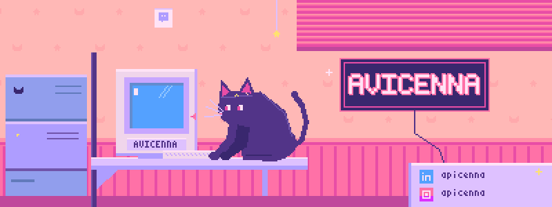

 

✦ ･ﾟ ✧ ･ﾟ ✦

## ✦ About Me

Backend Developer and System Analyst, Information Systems graduate of Telkom University. Detail-oriented, and used to turning business requirements into structured documentation (BPMN and use case diagrams), then implementing them as working systems through REST API design and database architecture. Holds a BNSP Web Developer competency certificate.

- 🎓 Information Systems, Telkom University
- 🔭 Currently building **Tawafly**, a Hajj and Umrah travel marketplace on Laravel, from requirements to deployment
- 🧪 Experience as a Quality Assurance Intern and IT Support Intern
- 👩‍🏫 Three-time lab assistant (Programming, OOP, and Web Application Development)

✦ ･ﾟ ✧ ･ﾟ ✦

## ✦ Tech Stack

**Systems analysis:** BPMN, UML, Use Case Diagrams, REST API Design

✦ ･ﾟ ✧ ･ﾟ ✦

## ✦ Experience

- **Quality Assurance Intern, PT. Capio Teknologi Indonesia** (Jun to Sep 2025): manually tested a futures trading platform for a client, wrote test cases and test scenarios, documented test plans and test reports, and reported bugs with reproduction steps.
- **Web Application Development Lab Assistant** (Feb to Sep 2025): guided 4+ student groups, helped troubleshoot development issues, and prepared modules and exercises.
- **IT Support Intern, PT. Sygma Media Inovasi** (Jan to Sep 2024): helped develop a web-based CMS for Qursa, an Islamic content platform that indexes 600 pages of the Quran, using React.js.
- **Project-Based Virtual Intern Fullstack Developer, BTPN Syariah x Rakamin Academy** (Aug to Sep 2023): built a REST API (POST, GET, PUT, DELETE), implemented JWT authentication, and tested endpoints with Postman.

<b>♡ More lab assistant roles, organizations, and certifications</b>

 

**Certifications**
- Web Developer Competency Certificate, BNSP (2025)
- English Proficiency Test, Telkom University
- Fullstack Developer Competency Certificate, BTPN Syariah Virtual Experience Program

✦ ･ﾟ ✧ ･ﾟ ✦

## ✦ Featured Projects

| Project | Problem Solved | Stack | Role |
|---|---|---|---|
| **Tawafly** | Connects verified Hajj and Umrah travel agents with prospective pilgrims on a single platform, with a rule-based NLP chatbot | Laravel, FastAPI, MySQL | Solo developer and system analyst, thesis project with an industry client |
| [**CleanTime**](https://github.com/apicennaa/CleanTime) | Laravel | [FILL IN: Backend Developer] |
| [**LogistIQ**](https://github.com/apicennaa/LogistIQ-Flask-API-Laravel-UI-) | Flask API, Laravel UI | [FILL IN: Backend Developer] |

✦ ･ﾟ ✧ ･ﾟ ✦

## ✦ Contribution Snake

My contribution graph gets eaten by a snake and refreshes automatically every day.

  <picture>
    <source media="(prefers-color-scheme: dark)" srcset="https://raw.githubusercontent.com/apicennaa/apicennaa/output/github-snake-dark.svg" />
    <source media="(prefers-color-scheme: light)" srcset="https://raw.githubusercontent.com/apicennaa/apicennaa/output/github-snake.svg" />
    
  </picture>

✦ ･ﾟ ✧ ･ﾟ ✦

## ✦ GitHub Stats

✦ ･ﾟ ✧ ･ﾟ ✦

## ✦ Get in Touch

